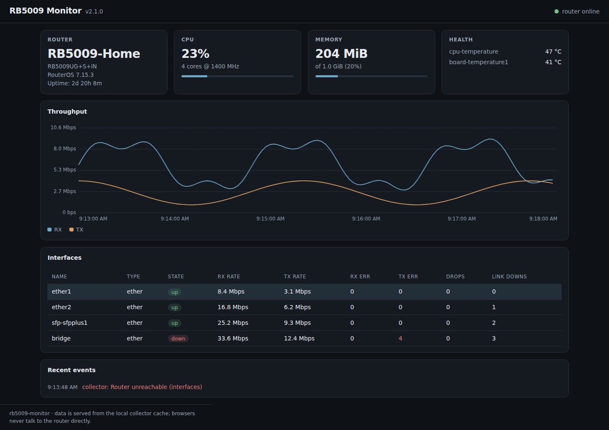
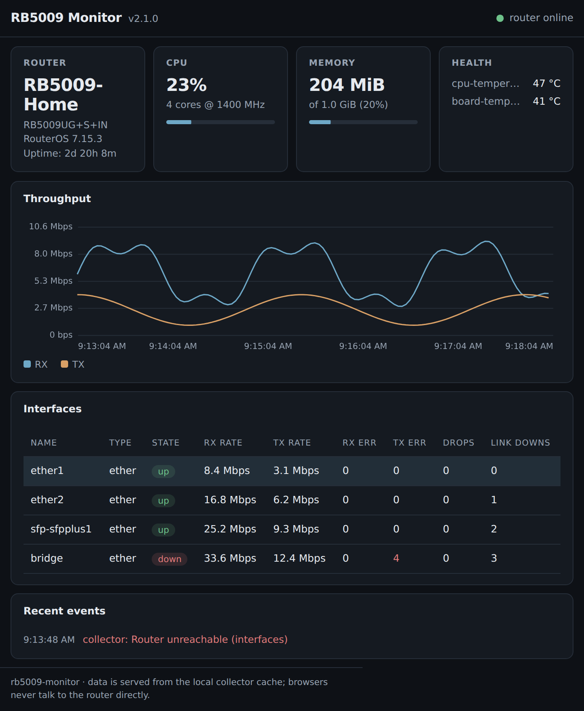
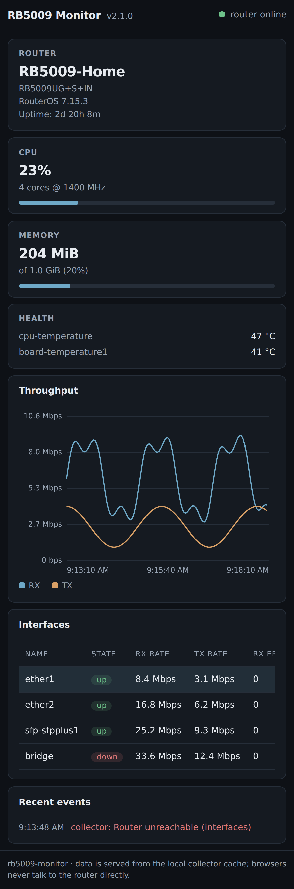
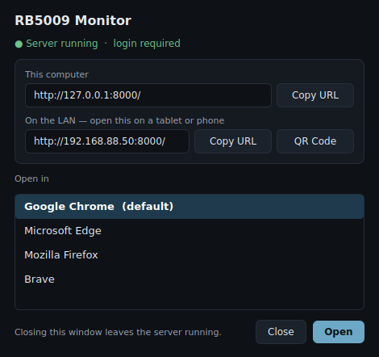
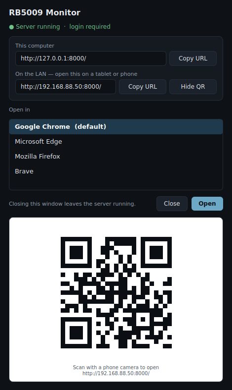

# ros-ui-monitor

## Phase B

UI for MikroTik RouterOS diagnostic and monitoring tools. (Only test on RB5009)

`rb5009-monitor.exe` is a Windows, LAN-only monitoring dashboard for a MikroTik
RB5009, built as a modular Python project (FastAPI + Uvicorn + HTTPX + SQLite)
and packaged into a single executable with PyInstaller.

### Screenshots

The dashboard on a desktop browser:



The same page at 200% browser zoom and on a phone. Sizing is fluid, so text,
spacing and the chart scale together instead of the layout breaking or the
page scrolling sideways:

| 200% browser zoom | Phone |
| --- | --- |
|  |  |

> These screenshots were captured with sample data, not a live RB5009, so the
> router name, rates and sensor readings shown are illustrative.

### Scope

Only two phases are in scope, and **both ship as the same PyInstaller
executable** — what changes is the bind address and whether login is required:

- **Phase A — Windows localhost:** `rb5009-monitor.exe` binds `127.0.0.1`, so
  only this PC can open the dashboard.
- **Phase B — Windows LAN mode:** `rb5009-monitor.exe --lan` binds `0.0.0.0`,
  so trusted tablets and phones on the LAN can open the responsive web UI,
  protected by a dashboard password.

There is no Docker/Debian phase and no PWA phase, so the code carries no
container, cross-platform, or service-worker machinery.

### Assumptions

- Router address: `192.168.88.1`
- RouterOS API service ports: TCP `8728` (api) and `8729` (api-ssl, secure)
- The REST API itself is served over HTTPS by the RouterOS `www-ssl` service;
  the REST base URL defaults to `https://192.168.88.1` and is configurable
  via `RBMON_ROUTER_URL`

### Features

- Live dashboard: CPU, memory, uptime, health sensors (discovered dynamically)
- Interface table with state, throughput (derived from counter deltas),
  errors, drops and link-down counts
- Throughput chart per interface, drawn on a plain canvas — no chart library
  and no CDN, so the dashboard works with zero internet access
- Server-Sent Events push updates; browsers never talk to the router directly
  and RouterOS credentials never leave the application host
- SQLite history (WAL mode) with retention pruning, plus event log
  (connectivity changes, interface up/down, counter resets)
- Stale-data age indicators instead of silently showing old data as live
- Responsive layout with touch-sized controls for tablets and phones
- Dashboard login for LAN mode: PBKDF2 password hashing, HttpOnly session
  cookies, and per-client login rate limiting
- `/healthz` and `/readyz` endpoints; clean shutdown so SQLite is never corrupted

### Usage

```text
rb5009-monitor.exe                 Phase A: this PC only (127.0.0.1:8000)
rb5009-monitor.exe --lan           Phase B: LAN mode for tablets and phones
rb5009-monitor.exe --host 0.0.0.0 --port 8000
rb5009-monitor.exe --no-browser
rb5009-monitor.exe --chooser       Pick a browser / copy the URL (see below)
rb5009-monitor.exe --hash-password Generate a dashboard password hash
rb5009-monitor.exe --config "C:\ProgramData\RB5009Monitor\config.env"
```

### Browser chooser window (optional)

`--chooser` opens a small Qt window instead of launching the default browser:



It lists the browsers Windows reports as installed (read from
`HKEY_*\SOFTWARE\Clients\StartMenuInternet`, with the default browser promoted
to the top), and gives each URL a **Copy URL** button. In LAN mode the LAN URL
is shown as well, which is the one to send to a tablet or phone. Closing the
window leaves the server running; the browser is started detached, so it stays
open too.

The LAN row also has a **QR Code** button. It shows the code at the bottom of
the window, so a phone or tablet can open the dashboard by pointing its camera
at the screen instead of anyone typing an IP address:



The code is always drawn dark-on-light inside its own light panel, because
inverted QR codes are unreliable for phone cameras to read.

This needs PySide6 and segno, both optional extras because Qt is large:

```bash
pip install ".[gui]"
```

Executables built without it still accept `--chooser` and print an
instruction rather than failing obscurely. To build the executable *with* the
chooser, set `RBMON_BUILD_GUI=1` before running PyInstaller. Measured sizes:

| Build | Command | Size |
| --- | --- | --- |
| Default | `pyinstaller rb5009-monitor.spec` | 16 MB |
| With chooser | `RBMON_BUILD_GUI=1 pyinstaller rb5009-monitor.spec` | 73 MB |

From source:

```bash
pip install .
rb5009-monitor --no-browser        # or: python -m app.main
```

### Setting up LAN mode (Phase B)

1. Create a dashboard password hash and copy the printed line into your
   config file:

   ```text
   rb5009-monitor.exe --hash-password
   ```

   This stores only a PBKDF2-SHA256 hash, so the config file never contains
   the password itself. `RBMON_AUTH_PASSWORD` accepts plaintext instead if you
   prefer, but anyone who can read the file can then read the password.

2. Start in LAN mode:

   ```text
   rb5009-monitor.exe --lan
   ```

3. Allow `rb5009-monitor.exe` through Windows Firewall on the **private**
   network when prompted. The startup log prints the exact URL other devices
   should open, for example `http://192.168.88.50:8000/`.

4. Open that URL on the tablet or phone and sign in.

Notes on what LAN mode does and does not protect:

- Sessions are HttpOnly cookies with `SameSite=Lax`, held in memory, so every
  device is signed out when the service restarts. Failed logins are throttled
  per client address (5 attempts per 5 minutes by default).
- Traffic is plain HTTP on the LAN, so the password protects against casual
  access from other devices on the network, not against someone who can
  capture LAN traffic. Trusted HTTPS was part of the dropped Phase D.
- If no password is configured, LAN mode still starts but logs a warning and
  leaves the dashboard open to anyone on the LAN.
- The dashboard is read-only — it exposes no RouterOS write or diagnostic
  commands — so there are no viewer/administrator roles to configure.

### Configuration

Copy `config/config.example.env` to `config.env`, fill in a dedicated
read-only RouterOS monitoring user, and put it in one of the places below (or
set `RBMON_*` environment variables — the environment overrides the file).

The config file is looked for in this order:

1. `--config <path>`
2. `RBMON_CONFIG=<path>`
3. **`config.env` next to `rb5009-monitor.exe`** → portable mode
4. `C:\ProgramData\RB5009Monitor\config.env`

### Portable mode (keep everything next to the .exe)

Put `config.env` in the same folder as `rb5009-monitor.exe` and the database
goes there too, instead of `C:\ProgramData\RB5009Monitor\`:

```text
D:\RB5009Monitor\
├── rb5009-monitor.exe
├── config.env          <- presence of this file enables portable mode
└── monitor.db          <- created here on first run
```

`--portable` forces the same behaviour without a config file, and
`RBMON_DATA_DIR` overrides the location entirely. The startup log always
prints the directory in use.

Portable mode suits a USB stick or a folder you can delete in one go. Two
caveats: the folder must be writable, so avoid `C:\Program Files\` unless you
run elevated (the app checks at startup and exits with a clear message), and
anyone who can read the folder can read `config.env`, so prefer
`RBMON_AUTH_PASSWORD_HASH` over a plaintext password.

### Uninstalling

There is no installer and nothing is written to the registry, so removal is
just deleting files:

| What | Where | Removed with the .exe? |
| --- | --- | --- |
| Python runtime and all packages | bundled **inside** the .exe | Yes |
| `config.env`, `monitor.db` | portable mode: beside the .exe | Yes, delete the folder |
| `config.env`, `monitor.db` | default: `C:\ProgramData\RB5009Monitor\` | **No** — delete separately |
| Temporary extraction folder | `%TEMP%\_MEIxxxxxx` | Yes on clean exit; see below |

The application never installs Python or site-packages on the machine — every
dependency lives inside the executable, so no `pip uninstall` step exists.

On each run PyInstaller extracts the bundle to `%TEMP%\_MEIxxxxxx` and deletes
it on a clean exit (Ctrl+C or closing the window). If the process is killed
hard — Task Manager, a crash, power loss — that folder is orphaned and stays
behind at roughly 25 MB per occurrence. It is safe to delete any `_MEI*`
folder in `%TEMP%` while the application is not running.

Create the monitoring user on the router with a custom group (avoid the
built-in `read` group) limited to `rest-api` + `read`, restricted to the
monitoring PC's source address, and enable `www-ssl`.

### Building the Windows executable

Locally, on Windows — PyInstaller is not a cross-compiler, so the build
targets the CPU architecture of the machine you build on:

```powershell
powershell -ExecutionPolicy Bypass -File scripts\build-windows.ps1
# -> dist\rb5009-monitor.exe
```

The PyInstaller entry point is `run.py`, not `app/main.py`. PyInstaller runs
its entry script as a top-level `__main__` module with no parent package, so
freezing a module from inside the `app` package makes every relative import in
it fail at startup with *"attempted relative import with no known parent
package"* — the build succeeds and the executable is dead on arrival.
`run.py` sits outside the package and imports it absolutely, which keeps the
package intact. `python run.py --version` behaves the same as the frozen exe.

### Releases (automatic)

Every push to `main` triggers `.github/workflows/release.yml`, which builds the
executable on Windows runners and publishes a GitHub Release:

- Tag and release title: `vX.Y`
  - `X` = phase number from the `PHASE` file (Phase A → `1`, Phase B → `2`)
  - `Y` = auto-incremented per release within the phase, starting at `1`
- Attached binaries:
  - `ros-ui-monitor_vX_Y.exe` — x64 (amd64) build
  - `ros-ui-monitor_vX_Y_arm64.exe` — native ARM64 build, when an ARM64
    Windows runner is available; the x64 build otherwise runs on Windows on
    ARM through x64 emulation
- The release notes state the supported install targets and CPU architectures,
  and the version is stamped into the executable so `--version` matches the tag.

`PHASE` currently contains `2`, so the next release is `v2.1`.

### Tests

```bash
pip install ".[dev]"
pytest
```
