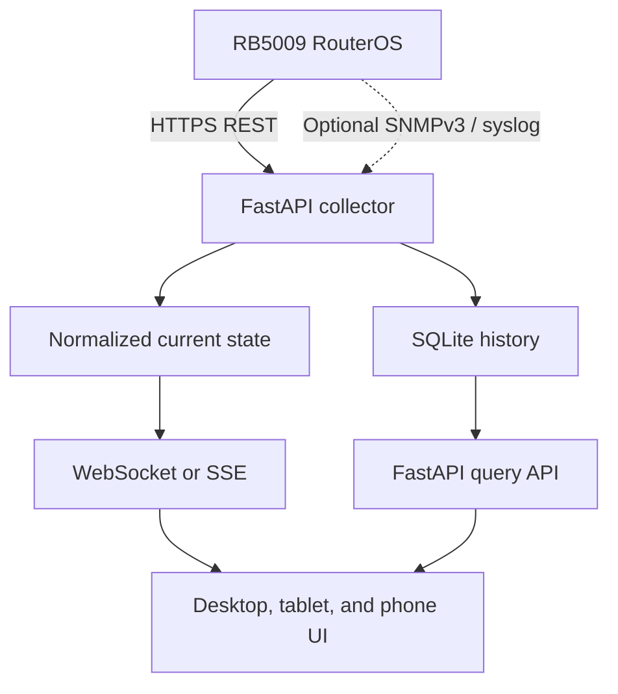

# RB5009 Monitor: Windows-First Build with a Later Debian/Docker Migration

## 1. Executive decision

Build one portable, LAN-only monitoring application with:

- Python 3.14, using the normal GIL-enabled CPython build
- FastAPI and Uvicorn for the web server
- HTTPX `AsyncClient` for RouterOS REST requests
- Jinja2 plus a small JavaScript layer for the responsive web interface
- ECharts or Chart.js for live and historical charts
- WebSocket or Server-Sent Events (SSE) for browser updates
- SQLite for settings, events, and historical samples
- PyInstaller for the initial Windows single-file executable
- Docker Compose for the later NAS/Debian deployment

The application should be developed as a normal, modular Python project. PyInstaller may distribute it as a single `.exe`, but the source code should not be implemented as one enormous Python file. This preserves maintainability and makes the later Linux/Docker migration straightforward.

The migration path is:

1. **Phase A — Windows:** run `rb5009-monitor.exe` on an existing Windows PC.
2. **Phase B — Windows LAN mode:** allow trusted tablets and phones to access the responsive web UI.
3. **Phase C — NAS/Debian or Docker:** move the same application source, configuration, and SQLite database to an always-on server.
4. **Phase D — PWA:** add trusted HTTPS, a web app manifest, service worker, and home-screen installation.

The Windows executable itself is not transferred to Debian. The portable application source, configuration, database, and static web assets are transferred and then run in Linux or built into a Linux container.

## 2. Product goals

### Primary goals

- Monitor an RB5009 from devices connected to the trusted LAN.
- Show current device health, resource usage, interface state, throughput, errors, and operational events.
- Retain useful historical data without excessive database growth.
- Provide bounded, user-initiated diagnostic tools.
- Keep RouterOS credentials on the application host and out of browsers.
- Work well in Chrome, Firefox, Safari, iPadOS desktop mode, and Android tablet browsers.
- Start on Windows without requiring a NAS.
- Move later to Debian or Docker without redesigning the application.

### Non-goals

- Exposing RouterOS management directly to the public internet.
- Continuously running Torch, packet capture, bandwidth tests, speed tests, flood ping, or traffic generation.
- Recreating every WinBox or WebFig configuration feature.
- Giving every dashboard user unrestricted RouterOS write access.
- Making the dashboard operate when the RB5009 itself is unreachable; cached history may remain available, but live router data cannot.

## 3. Why FastAPI is the preferred framework

FastAPI is the best fit because the workload is dominated by concurrent network I/O:

- multiple RouterOS REST requests;
- periodic background collection;
- simultaneous browser connections;
- WebSocket or SSE updates;
- timeouts, retries, and health checks.

FastAPI is ASGI-native and works naturally with asynchronous HTTP clients and long-lived browser connections.

Flask remains suitable for a small synchronous prototype, but its WSGI design and async compatibility layer are less natural for a monitoring service with concurrent polling and live connections.

Reflex is attractive when a pure-Python UI is the highest priority. However, it compiles a React/Next.js frontend, uses a FastAPI backend, and synchronizes state over WebSockets. That creates a larger packaging and deployment surface than needed for this LAN appliance. A lightweight FastAPI application serving its own static frontend will be easier to freeze as a Windows executable, customize as a PWA, and move into Docker.

Related framework documentation:

- [FastAPI documentation](https://fastapi.tiangolo.com/)
- [FastAPI concurrency and async/await](https://fastapi.tiangolo.com/async/)
- [FastAPI deployment concepts](https://fastapi.tiangolo.com/deployment/concepts/)
- [Uvicorn documentation](https://www.uvicorn.org/)
- [Flask async documentation](https://flask.palletsprojects.com/en/stable/async-await/)
- [How Reflex works](https://reflex.dev/docs/advanced-onboarding/how-reflex-works/)

## 4. RouterOS capabilities and constraints

The RouterOS REST API is a JSON wrapper around the RouterOS API. It supports reading, creating, modifying, and deleting resources, as well as calling console commands through `POST`.

Important constraints:

- REST authentication uses HTTP Basic Authentication.
- RouterOS should expose REST through `www-ssl`, not unencrypted `www`.
- REST responses encode values as strings, even when the underlying value is numeric or Boolean.
- Continuous commands such as `monitor` are not supported as continuous REST streams.
- Monitoring commands must use `once` or another bounded parameter.
- A REST command that runs indefinitely will eventually fail; the documented REST timeout is 60 seconds.
- `.proplist` should be used to request only fields needed by the dashboard.
- Expensive diagnostic tools should be user-initiated and time-limited.

Primary references:

- [RouterOS REST API](https://manual.mikrotik.com/docs/developer-guides/rest-api/)
- [RouterOS diagnostics and monitoring](https://manual.mikrotik.com/docs/diagnostics-monitoring-and-troubleshooting/)
- [RouterOS user and group policies](https://manual.mikrotik.com/docs/authentication-authorization-accounting/user/)
- [RB5009UG+S+IN specifications](https://mikrotik.com/product/rb5009ug_s_in)

## 5. Recommended architecture



The application host is the only component that communicates with the router. Browsers communicate only with FastAPI.

This provides:

- one polling schedule regardless of the number of open dashboards;
- no RouterOS credentials in browser storage or JavaScript;
- lower REST load on the router;
- central rate limiting;
- consistent type and unit conversion;
- retained history even when no browser is open.

### Application services

1. **RouterOS client**
   - Maintains one reusable HTTPX connection pool.
   - Applies authentication, certificate validation, timeouts, and error handling.
   - Converts RouterOS error responses into application-specific exceptions.

2. **Collector scheduler**
   - Runs one collection loop per metric group.
   - Prevents overlapping runs of the same job.
   - Applies backoff when the router is unavailable.
   - Adds small timing jitter so every request does not hit the router simultaneously.

3. **Normalizer**
   - Converts RouterOS string values into integers, floats, Booleans, byte counts, durations, rates, temperatures, and timestamps.
   - Preserves the raw value when parsing is uncertain.
   - Handles fields that vary by RouterOS version or hardware.

4. **Current-state cache**
   - Holds the latest normalized snapshot in memory.
   - Serves the dashboard without requesting the router for every page load.

5. **History store**
   - Writes selected time-series samples and events to SQLite.
   - Uses retention and downsampling rules.

6. **Live-update service**
   - Publishes changed state to connected browsers using SSE or WebSockets.
   - SSE is sufficient for one-way live dashboard updates.
   - WebSockets are useful if interactive commands and bidirectional state become extensive.

7. **Diagnostic runner**
   - Runs only approved, bounded commands.
   - Allows only one resource-intensive operation at a time.
   - Records the requesting user, parameters, start time, end time, and result.

## 6. Monitoring coverage

“All parameters” should not mean polling every RouterOS command at a high frequency. The monitoring surface should be divided into safe telemetry, slow inventory, events, and active diagnostics.

### Continuous or frequent telemetry

| Area | Example RouterOS path or command | Suggested cadence |
| --- | --- | --- |
| Device resources | `/rest/system/resource` | 5 seconds |
| Per-core CPU | `/rest/system/resource/cpu` | 5–10 seconds |
| Hardware health | `/rest/system/health` | 10–30 seconds |
| Interface status and counters | `/rest/interface` with a limited `.proplist` | 2–5 seconds |
| Interface live rates | `interface monitor-traffic` with `once` | 2–5 seconds while viewed |
| Queue summary | relevant `/rest/queue/...` resources | 10–30 seconds |
| VPN status | relevant IPsec, WireGuard, PPP, or interface resources | 10–30 seconds |

Useful references:

- [RouterOS Resource monitoring](https://manual.mikrotik.com/docs/diagnostics-monitoring-and-troubleshooting/resource)
- [RouterOS Health monitoring](https://manual.mikrotik.com/docs/diagnostics-monitoring-and-troubleshooting/health)
- [Interface statistics and monitor-traffic](https://manual.mikrotik.com/docs/diagnostics-monitoring-and-troubleshooting/interface-stats-and-monitor-traffic)

The RB5009 product specification confirms CPU temperature monitoring. The UI must nevertheless discover available health sensors dynamically because the exact sensor list varies by RouterBOARD model and RouterOS version.

### Slower operational inventory

| Area | Suggested cadence |
| --- | --- |
| DHCP leases and ARP/neighbor summaries | 30–60 seconds |
| Routing summary and default-route state | 30–60 seconds |
| DNS and DHCP server status | 30–60 seconds |
| Firewall rule counters and connection count | 15–60 seconds |
| Bridge, VLAN, bonding, and interface inventory | 1–5 minutes |
| RouterOS package/version inventory | 5–30 minutes |
| User sessions and service status | 1–5 minutes |

Large resources such as firewall connection tracking must be filtered or summarized. The dashboard should not repeatedly download the complete connection table merely to display a count.

### Events and logs

REST can retrieve snapshots from `/log`, but a remote syslog receiver is a better long-term source for durable events. The first Windows edition may poll recent logs with deduplication. The NAS edition can optionally listen for or integrate with remote syslog.

- [RouterOS logging](https://manual.mikrotik.com/docs/diagnostics-monitoring-and-troubleshooting/log/)

### On-demand diagnostics

These functions belong on a Diagnostics page and must not be scheduled continuously:

- Ping with a maximum count
- Traceroute with a maximum timeout
- Torch with a selected interface and short duration
- IP scan limited to an approved subnet
- Profiler snapshot
- Packet capture with interface, filter, duration, and file-size limits
- Speed test or bandwidth test with explicit confirmation and short duration

Traffic Generator and flood ping should be disabled by default. They can affect network availability and are rarely necessary in an ordinary monitoring dashboard.

## 7. Optional hybrid telemetry

A REST-only first release is viable. For more complete and efficient monitoring later, add optional protocol adapters:

- **REST:** configuration, status, health, inventory, and bounded diagnostics.
- **SNMPv3:** counters, supported OIDs, and traps.
- **Remote syslog:** durable operational and security events.
- **Traffic Flow/IPFIX:** per-flow analytics.

References:

- [RouterOS SNMP](https://manual.mikrotik.com/docs/diagnostics-monitoring-and-troubleshooting/snmp)
- [RouterOS Traffic Flow](https://manual.mikrotik.com/docs/diagnostics-monitoring-and-troubleshooting/traffic-flow/)
- [RouterOS Graphing](https://manual.mikrotik.com/docs/diagnostics-monitoring-and-troubleshooting/graphing)

Traffic Flow sees traffic processed by the router CPU. Hardware-offloaded bridged traffic may not appear in exported flows, so it cannot be treated as a complete accounting source for every topology.

## 8. Polling and load-control policy

The collector should implement these rules:

- Only one collector instance polls a router.
- Browser refreshes never trigger direct RouterOS requests.
- Use `.proplist` for every resource where a smaller response is possible.
- Poll live interface rates rapidly only while at least one client is viewing the live page.
- Fall back from 2 seconds to 5–10 seconds when no live dashboard is open.
- Do not start a new poll if the previous poll of that group is still running.
- Use connection and read timeouts shorter than the RouterOS 60-second REST limit.
- Retry only safe reads automatically.
- Apply exponential backoff on connection failure.
- Place a concurrency semaphore around RouterOS requests.
- Never retry configuration writes or destructive actions automatically.
- Show stale-data age in the UI rather than silently displaying old data as live.

A sensible initial concurrency limit is two to four RouterOS requests. It should be configurable after measuring the specific router configuration.

## 9. Data normalization

RouterOS values require explicit conversion. Examples include:

- `"true"` and `"false"` to Boolean values;
- `"23%"` to a numeric percentage;
- `"94.2MiB"` to bytes;
- `"2d20h12m20s"` to a duration;
- bit-rate strings to bits per second;
- sensor values and types to a consistent measurement representation.

Health monitoring requires extra care because RouterOS documentation notes that some API/script/SNMP sensor representations may use scaled values. Store:

- raw value;
- raw unit/type;
- normalized value;
- normalized unit;
- parser version.

This makes future parser corrections possible without losing the original observation.

## 10. SQLite storage design

Suggested tables:

| Table | Purpose |
| --- | --- |
| `routers` | Router identity and non-secret connection metadata |
| `device_samples` | CPU, memory, disk, uptime, and health observations |
| `interface_samples` | Interface traffic, packets, errors, drops, and link state |
| `events` | Logs, state changes, alerts, and collector errors |
| `diagnostic_runs` | Parameters, audit information, status, and bounded results |
| `users` | Local dashboard accounts and roles, if authentication is enabled |
| `settings` | Application settings that are not secrets |
| `schema_migrations` | Database schema version |

Recommended storage policy:

- Write detailed interface samples every 5 seconds only for selected interfaces.
- Retain high-resolution data for 24–72 hours.
- Downsample older observations to 1-minute and then 15-minute aggregates.
- Retain significant events longer than raw samples.
- Use SQLite WAL mode.
- Allow only the application to write the database.
- Create scheduled backups using SQLite’s safe backup mechanism rather than copying an actively written database file blindly.

SQLite is sufficient for one RB5009 and a small number of users. Keep storage behind a repository interface so PostgreSQL can be added later without changing RouterOS collection or UI code.

## 11. Proposed source layout

```text
rb5009-monitor/
├── app/
│   ├── main.py
│   ├── lifespan.py
│   ├── config.py
│   ├── security.py
│   ├── routeros/
│   │   ├── client.py
│   │   ├── parsers.py
│   │   ├── resources.py
│   │   └── diagnostics.py
│   ├── collectors/
│   │   ├── scheduler.py
│   │   ├── resources.py
│   │   ├── interfaces.py
│   │   ├── health.py
│   │   └── logs.py
│   ├── database/
│   │   ├── models.py
│   │   ├── repositories.py
│   │   └── migrations.py
│   ├── api/
│   │   ├── status.py
│   │   ├── history.py
│   │   ├── diagnostics.py
│   │   └── healthcheck.py
│   ├── templates/
│   └── static/
│       ├── css/
│       ├── js/
│       ├── icons/
│       ├── manifest.webmanifest
│       └── service-worker.js
├── config/
│   └── config.example.env
├── data/
├── tests/
├── scripts/
│   ├── build-windows.ps1
│   └── migrate-data.py
├── pyproject.toml
├── Dockerfile
├── compose.yaml
└── README.md
```

## 12. Configuration strategy

Use environment variables and an external configuration file. Example variable names:

```dotenv
RBMON_ROUTER_URL=https://192.168.88.1
RBMON_ROUTER_USERNAME=rbmon
RBMON_ROUTER_PASSWORD=
RBMON_ROUTER_CA_FILE=
RBMON_DATA_DIR=
RBMON_BIND_HOST=127.0.0.1
RBMON_BIND_PORT=8000
RBMON_LOG_LEVEL=INFO
RBMON_ENABLE_DIAGNOSTICS=false
RBMON_SESSION_SECRET=
```

Rules:

- Do not compile passwords or session keys into the executable.
- Allow secrets to come from Windows Credential Manager initially if implemented.
- Prefer Docker secrets or protected environment files on the NAS.
- Use `pathlib` for paths.
- Keep default paths OS-aware.
- Validate configuration before starting the collector.
- Never log passwords, Basic Authentication headers, cookies, or full diagnostic payloads containing sensitive data.

## 13. Security design

### RouterOS side

- Enable `www-ssl`.
- Install or generate a RouterOS certificate and trust its issuing CA on the application host.
- Restrict the RouterOS REST service to the monitoring host using RouterOS service/firewall controls.
- Create a dedicated custom RouterOS user group.
- Restrict the user’s allowed source address to the monitoring PC or NAS.
- Use a strong, unique password.

Avoid assigning the built-in RouterOS `read` group without reviewing it. MikroTik documents that the default group includes additional policies such as sensitive, reboot, test, and sniff.

Prefer two RouterOS identities:

1. **Monitoring identity**
   - `rest-api`
   - `read`
   - only the additional rights proven necessary

2. **Diagnostic identity**
   - enabled only if on-demand diagnostics are required
   - `test` for appropriate test commands
   - `sniff` only if Torch or packet capture is intentionally enabled
   - no `write`, `policy`, `reboot`, or `sensitive` unless a separately designed administrative feature genuinely requires it

Actual command authorization should be verified on the installed RouterOS version because RouterOS policy boundaries do not map perfectly to application feature names.

### Application side

- Bind to `127.0.0.1` by default on Windows.
- Require explicit LAN mode to bind to `0.0.0.0`.
- Protect LAN mode with local authentication if the LAN is not fully trusted.
- Use secure, HTTP-only session cookies under HTTPS.
- Add CSRF protection to every state-changing operation.
- Implement viewer and administrator roles.
- Require confirmation for every disruptive diagnostic or configuration action.
- Rate-limit logins and diagnostic endpoints.
- Record an audit event for diagnostic and administrative actions.
- Never provide a generic “execute RouterOS script” endpoint to the browser.
- Use an allowlist of commands and parameters.

## 14. Windows-first deployment

### User experience

The executable should support:

```text
rb5009-monitor.exe
rb5009-monitor.exe --host 0.0.0.0 --port 8000
rb5009-monitor.exe --no-browser
rb5009-monitor.exe --config "C:\ProgramData\RB5009Monitor\config.env"
```

Default behavior:

1. Validate configuration.
2. Start FastAPI/Uvicorn on `127.0.0.1:8000`.
3. Wait until the `/readyz` endpoint succeeds.
4. Open the default browser.
5. Keep running until the process receives a clean shutdown signal.

Optional later additions:

- notification-area launcher;
- Windows service installation;
- automatic startup;
- a setup wizard for the RouterOS address and certificate;
- a read-only connection test.

### Persistent Windows data

Do not store mutable data inside the PyInstaller bundle. Use a persistent directory such as:

```text
C:\ProgramData\RB5009Monitor\
├── config.env
├── monitor.db
├── certificates\
├── backups\
└── logs\
```

PyInstaller one-file applications extract bundled files at runtime, so the bundle is not a durable data directory.

### Packaging

Use PyInstaller initially because it is straightforward and supports modern Python releases. Build the Windows executable on Windows; PyInstaller is not a cross-compiler.

- [PyInstaller documentation](https://pyinstaller.org/)
- [PyInstaller usage](https://pyinstaller.org/en/stable/usage.html)

Nuitka may be evaluated later, but compiler-level optimization is unlikely to materially improve RouterOS polling because the application is network-I/O-bound.

- [Nuitka documentation](https://nuitka.net/doc/user-manual.html)

## 15. Later Debian or Docker deployment

### Preferred NAS deployment

Use Docker Compose if the NAS has good Docker support. Otherwise, run the application as a Debian `systemd` service.

Docker responsibilities:

- build the same Python application for Linux;
- run as a non-root user;
- mount configuration read-only where possible;
- mount a persistent data volume;
- expose only the application port;
- include a health check against `/healthz`;
- stop gracefully so database writes complete;
- restart unless explicitly stopped.

Conceptual persistent mounts:

```yaml
volumes:
  - ./data:/app/data
  - ./config:/app/config:ro
```

The future NAS may be `amd64` or `arm64`. Select an image matching the NAS CPU or produce a multi-architecture image. Do not assume that an image built on an existing x86 Windows PC will run on an ARM NAS.

### Data migration

Migration steps:

1. Stop the Windows application cleanly.
2. Create a verified SQLite backup.
3. Copy the backup, configuration template, trusted CA certificate, and required application settings to the NAS.
4. Store secrets using the NAS/Docker secret mechanism.
5. Start the container or Debian service.
6. Run database migrations automatically before starting collectors.
7. Verify `/healthz`, `/readyz`, RouterOS connectivity, and historical charts.
8. Change the RB5009 monitoring user’s allowed source address from the Windows PC to the NAS.
9. Disable the old Windows collector so two instances do not poll the router.

The collector should implement an instance lock or lease to help prevent accidental double polling.

## 16. PWA and HTTPS plan

The responsive web UI should work from the beginning without PWA installation. Add these PWA assets early so the frontend does not require redesign:

- `manifest.webmanifest`;
- application icons;
- responsive theme colors;
- standalone display mode;
- `service-worker.js`;
- offline shell and “router unavailable” state;
- update notification behavior.

Service workers require a secure context. `http://localhost` is treated specially for local development, but `http://192.168.x.x` on a phone or tablet is not equivalent to localhost. Full PWA behavior therefore requires trusted HTTPS for LAN clients.

References:

- [MDN Service Worker API](https://developer.mozilla.org/en-US/docs/Web/API/Service_Worker_API)
- [W3C Secure Contexts](https://www.w3.org/TR/secure-contexts/)
- [PWA installation](https://web.dev/learn/pwa/installation)
- [Apple: What’s new in web apps](https://developer.apple.com/videos/play/wwdc2023/10120/)

Recommended progression:

1. Windows localhost access over HTTP during early development.
2. Optional ordinary LAN browser access during the Windows phase.
3. Trusted LAN hostname and HTTPS when convenient.
4. On the NAS, terminate HTTPS through a reverse proxy.
5. Install the issuing CA on managed LAN devices if using a private CA.
6. Enable PWA installation only after the browser reports a secure context.

The service worker should cache the application shell, icons, and static resources. It should not pretend stale telemetry is current. Cached measurements must be visibly labeled with their collection time and offline/stale status.

## 17. Python version

Use the latest patched Python 3.14 release available when development begins.

Reasons:

- Python 3.14 is a stable release.
- Current FastAPI and Reflex package metadata include Python 3.14 support.
- Current PyInstaller releases include Python 3.14 support.
- Python 3.14 includes improved asyncio inspection and runtime improvements useful for diagnosing a long-running asynchronous service.

Use the normal GIL-enabled interpreter. Free-threaded Python and the experimental JIT are unnecessary for the first release. RouterOS response latency, connection reuse, polling frequency, response size, browser rendering, and database retention will have a much greater effect on performance than the difference between Python 3.13 and 3.14.

Use Pydantic v2 and pin tested dependency versions.

References:

- [What’s new in Python 3.14](https://docs.python.org/3/whatsnew/3.14.html)
- [FastAPI package metadata](https://pypi.org/project/fastapi/)
- [Reflex package metadata](https://pypi.org/project/reflex/)

## 18. Web interface proposal

### Dashboard

- Router identity, RouterOS version, uptime, and last successful poll
- CPU and memory cards
- CPU temperature and discovered health sensors
- WAN state, public-address summary, and default-route status
- Interface throughput chart
- Packet errors, drops, link-down counts, and warning indicators
- Active alerts and recent significant events

### Interfaces

- Physical and virtual interfaces
- Running/disabled state
- Link speed and duplex where available
- RX/TX rates
- Packets, errors, discards, and queue drops
- Historical chart per interface
- Explicit indication of counter reset or router reboot

### Network

- DHCP lease summary
- ARP/neighbor summary
- Route summary
- DNS/DHCP service status
- VPN peer/tunnel status
- Firewall and connection summary without downloading unnecessarily large tables

### Diagnostics

- Ping
- Traceroute
- Short Torch session
- Profiler snapshot
- Restricted packet capture
- Restricted IP scan
- Speed/bandwidth test behind an explicit warning and confirmation

### Events

- RouterOS logs
- interface up/down events
- collector connectivity failures
- temperature/resource thresholds
- diagnostic audit history

### Settings

- poll cadences
- history retention
- interfaces included in high-resolution sampling
- alert thresholds
- read-only RouterOS connection test
- certificate status
- diagnostic feature switches

## 19. API outline

The browser-facing API should expose application data, not generic RouterOS access:

```text
GET  /api/v1/status
GET  /api/v1/interfaces
GET  /api/v1/interfaces/{name}/history
GET  /api/v1/events
GET  /api/v1/health
POST /api/v1/diagnostics/ping
POST /api/v1/diagnostics/traceroute
POST /api/v1/diagnostics/torch
GET  /api/v1/diagnostics/{run_id}
GET  /api/v1/stream
GET  /healthz
GET  /readyz
```

Do not expose endpoints such as `/proxy/rest/{path}` or accept arbitrary RouterOS command strings. Every supported action should have a validated request model, allowlisted target command, bounded values, authorization check, timeout, and audit record.

## 20. Testing plan

### Unit tests

- RouterOS string and unit parsers
- configuration validation
- retention/downsampling logic
- alert thresholds
- diagnostic parameter limits
- authorization rules

### Integration tests

- mocked RouterOS REST success and error responses
- TLS verification failure
- authentication failure
- router timeout and reconnect
- schema migration
- SSE/WebSocket reconnect
- graceful shutdown
- stale-data behavior

### Router tests

Run against the actual RB5009 using a restricted test identity:

- confirm every intended REST path;
- record the fields returned by the installed RouterOS version;
- verify policy requirements;
- measure REST latency and CPU impact;
- verify health sensor scaling;
- test counter behavior after reboot and interface reset;
- confirm diagnostic cancellation and timeout.

### Browser tests

- current desktop Chrome, Firefox, and Safari where available;
- iPadOS Safari in portrait, landscape, and desktop mode;
- Android Chrome;
- home-screen PWA launch after HTTPS is configured;
- responsive charts under tablet split-screen sizes.

### Packaging tests

- clean Windows system without Python installed;
- paths containing spaces;
- non-administrator Windows account;
- Windows firewall prompt and LAN mode;
- clean Docker build on `amd64`;
- `arm64` build if required by the selected NAS;
- backup and migration from Windows SQLite to Docker.

## 21. Implementation milestones

### Milestone 1 — Read-only foundation

- FastAPI application lifecycle
- validated configuration
- RouterOS HTTPS client
- resource, health, and interface snapshots
- current-state cache
- basic dashboard
- `/healthz` and `/readyz`

### Milestone 2 — Live dashboard and history

- centralized scheduler
- SSE or WebSocket updates
- interface charts
- SQLite persistence
- retention and downsampling
- stale-data indicators

### Milestone 3 — Windows distribution

- external data directory
- automatic browser launch
- PyInstaller build
- configuration wizard or documented configuration
- clean-machine installation testing

### Milestone 4 — Operational coverage

- DHCP, routes, queues, VPN, firewall summaries
- log/event ingestion
- alerts
- local viewer/admin authentication

### Milestone 5 — Bounded diagnostics

- ping and traceroute
- selected additional tools
- diagnostic queue and cancellation
- confirmations, roles, and audit trail

### Milestone 6 — Docker and PWA

- Dockerfile and Compose configuration
- non-root runtime
- persistent volumes
- database migration/backup procedure
- reverse-proxy HTTPS
- manifest, service worker, offline shell, and installation tests

## 22. Acceptance criteria

The first Windows release is successful when:

- it runs on a clean supported Windows PC without a separate Python installation;
- the dashboard opens locally and can optionally be enabled for LAN access;
- it never sends RouterOS credentials to the browser;
- it reconnects after router or network interruption;
- it shows the age of every cached data group;
- it does not continuously run expensive RouterOS diagnostic commands;
- it stores its database and configuration outside the executable;
- it shuts down without corrupting SQLite;
- all RouterOS actions are allowlisted and audited.

The later NAS migration is successful when:

- the same application code runs under Debian or Docker;
- Windows history is preserved;
- only one collector polls the RB5009;
- Docker replacement does not remove persistent data;
- HTTPS is trusted by desktop and mobile clients;
- the UI can be installed and launched as a PWA;
- RouterOS access is restricted to the NAS address.

## 23. Main risks and mitigations

| Risk | Mitigation |
| --- | --- |
| Excessive REST polling | Central collector, `.proplist`, cadence groups, concurrency limits |
| RouterOS field differences | Dynamic discovery, raw-value preservation, parser tests |
| Credentials exposed over HTTP | RouterOS `www-ssl`, certificate validation, server-side credentials |
| Excessive diagnostic load | Disabled by default, bounded parameters, single-job semaphore |
| Large SQLite database | Retention, aggregation, selected-interface high-resolution data |
| Two collectors after migration | Instance lock, source-IP restriction, migration checklist |
| PWA unavailable on LAN IP over HTTP | Trusted hostname and HTTPS |
| Windows-specific code blocks Linux migration | Portable core, OS-specific launcher isolated in scripts |
| NAS uses ARM rather than x86 | Multi-architecture Docker build or architecture-specific image |
| PyInstaller data loss misconception | External persistent data directory |

## 24. Final recommendation

Start with a Windows-packaged FastAPI application, but design it immediately as an always-on web service with external configuration and storage. Use RouterOS REST for the first read-only collector, implement live monitoring through centralized `monitor once` polling, and reserve active diagnostic tools for bounded user requests.

When a NAS becomes available, migrate the source, a safe SQLite backup, trusted certificates, and configuration into a Debian or Docker deployment. Add reverse-proxy HTTPS and enable full PWA installation at that stage. This approach delivers useful monitoring now without creating a Windows-only application that must be rewritten later.
